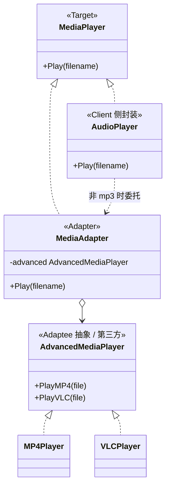

# 适配器模式（Adapter）— Go 语言

核心一句话：

> **接口对不上时，中间加一层「转接头」，让旧实现能被新客户端使用。**  
> 客户端只认目标接口；适配器内部翻译成被适配者的调用。

本例：媒体播放器。客户端要的是 `MediaPlayer.Play(filename)`；现成只有播 MP4 / VLC 的第三方库接口不同。用适配器把它们「转」成统一的 `MediaPlayer`。

---

## 1. 用一张表想清楚

| | 客户端期望 | 第三方已有 |
|---|---|---|
| **接口** | `MediaPlayer.Play(file)` | `MP4Player.PlayMP4` / `VLCPlayer.PlayVLC` |
| **能直接用吗** | — | 不能，方法名 / 形态不对 |
| **适配后** | 仍调 `Play` | 适配器内部转发到对应第三方 |

### 1.1 不会适配器时

业务里写满分支：

```go
if isMP4(file) {
    mp4.PlayMP4(file)
} else if isVLC(file) {
    vlc.PlayVLC(file)
}
```

每加一种格式，调用处继续膨胀；客户端和第三方强耦合。

### 1.2 会适配器时

```text
player := NewAudioPlayer()          // 对外仍是 MediaPlayer
player.Play("song.mp4")             → 内部用 MP4Adapter
player.Play("movie.vlc")            → 内部用 VLCAdapter
```

- 客户端只认 `MediaPlayer`。
- 新格式 = 新适配器，旧客户端代码少动。

---

## 2. 定义

### 2.1 官方味道的定义

适配器是一种**结构型**设计模式：将一个类的接口转换成客户希望的另一个接口，使原本接口不兼容的类可以一起工作。

做法是：

1. 定义客户端依赖的目标接口（`MediaPlayer`）。
2. 被适配者保持原样（`MP4Player` / `VLCPlayer`）。
3. 适配器实现目标接口，内部持有被适配者并做方法翻译。

### 2.2 角色关系（UML 类图）



| 模式角色 | 本例 | 含义 |
|----------|------|------|
| Target | `MediaPlayer` | 客户端想要的接口 |
| Adaptee | `MP4Player` / `VLCPlayer` | 已有、但不兼容的实现 |
| Adapter | `MediaAdapter` | 把 Adaptee 翻译成 Target |
| Client | `AudioPlayer` / `main` | 只调 `Play` |

Go 里常见的是**对象适配器**（持有 Adaptee）；没有继承时不必纠结「类适配器」。

---

## 3. 和代理 / 装饰器的区别（一句话）

| | 适配器 | 代理 | 装饰器 |
|---|---|---|---|
| **意图** | **换接口**，让不兼容的能用 | **控访问**（懒加载、鉴权） | **加职责**（增强行为） |
| **接口关系** | Target ≠ Adaptee | Proxy ≈ Subject | Decorator ≈ Component |
| **有没有「翻译」** | 有，核心就是翻译 | 通常原样转发 | 转发前后加料 |

第三方接口和你系统对不上 → 适配器；接口已经对，只是想拦一层 → 代理。

---

## 4. 怎么跑

```bash
go run .
```

或：

```bash
go run main.go
```

观察输出：`mp3` 直接播；`mp4` / `vlc` 经适配器转到第三方播放器；不支持的格式给出提示。

---

## 5. 适用与注意

适合：

- 要复用现有类，但其接口与系统不匹配。
- 统一多家第三方 SDK 到同一套接口。
- 渐进迁移：旧 API 包一层适配器，新代码先写新接口。

注意：

- 适配器只做接口转换，别塞复杂业务。
- 适配层过厚说明边界没划清，可能该重新建模而不是无限转接。
- 一个适配器通常对准一类 Adaptee；别做成巨型 `switch` 上帝适配器（本例 `MediaAdapter` 已尽量收束）。
