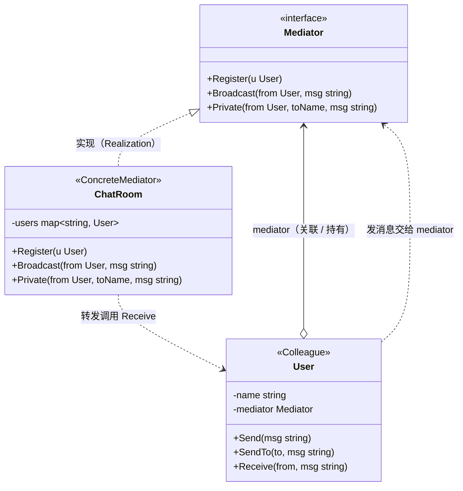

# 中介者模式（Mediator Pattern）— Go 语言

中介者模式的核心一句话：

> **让对象之间不直接认识**——把「多对多」的相互引用收拢到一个中介者身上，成员只跟中介者说话，中介者负责转发给其他人。

---

## 1. 定义

### 1.1 官方味道的定义

中介者模式是一种**行为型**设计模式：用一个中介对象来封装一组对象的交互，使它们不再显式地互相引用，从而降低耦合度，并且可以独立地改变它们之间的交互。

做法是：

1. **Mediator（中介者）** 定义对象间交互的统一接口。
2. **Colleague（同事）** 是参与相互交互的对象，只持有中介者的引用，不持有任何其他同事的引用。
3. **ConcreteMediator（具体中介者）** 实现转发逻辑，真正把某个同事的消息派发给其他同事。

### 1.2 角色关系（UML 类图）

以「聊天室」为例（对应本目录代码）：



图例（对照教科书 UML）：

| 线 | UML 含义 | 在本例里 |
|----|----------|----------|
| `◁‥` 虚线空心三角 | 实现接口（Realization） | `ChatRoom` 实现 `Mediator`（Go 里靠方法集满足接口） |
| `o→` 实线 | 关联 / 聚合 | `User` 持有 `mediator`，`ChatRoom` 持有全部 `users` |
| `‥>` 虚线箭头 | 依赖（Dependency） | 发消息、转发，两者通过接口/调用互相依赖 |

结构速览（和上面 UML 同一回事）：

```text
Alice ─┐   ┌─ Bob
       └──►│ ChatRoom（中介者）
Carol ─┘   └─ ……
```

要点：

- 同事（User）之间没有任何相互引用：Alice 不持有 Bob、Carol，反之亦然。
- 所有「消息该往哪去」的判断（群发 / 私聊 / 找不到人）集中在 ChatRoom。
- 新增一个同事，老同事零改动；真正变化的逻辑只落在中介者一身。
- 网状 `多对多` 的引用，塌缩成以中介者为中心的 `一对多`。

### 1.3 和「观察者模式」差在哪（一句话）

观察者是被观察者主动 `Notify`、观察者各自订阅，方向是「发布 → 订阅」的单向广播；中介者是同事之间通过中介**互相**通信，中介还承担「转发给谁、怎么转发」的仲裁职责。

---

## 2. 常见场景

| 场景 | 为什么适合 |
|------|------------|
| 聊天室 / IM | 每个成员不必持有全部其他成员引用 |
| 表单控件联动 | 下拉框、输入框、复选框互相影响，用对话框统一调度 |
| UI 弹窗 / 对话框 | 众多按钮、输入项把事件都交给容器（对话框）协调 |
| 航班调度塔台 | 飞机之间不互相喊话，统一向塔台报告 |
| 微服务消息总线 | 服务不直接互相调用，统一走总线/队列 |

Go 里更接地气的说法：

- 多个组件互相传消息时，A 改个签名，B、C、D 都要跟着改。
- 你希望"新增一个参与者"这件事，只加代码、不动老代码。
- 转发规则（广播、点对点、忽略某类消息）希望收拢在同一个地方。

此时用 Mediator 把相互引用收起来。

---

## 3. 示范代码

下面用「多人聊天室」说明：成员只认识聊天室，聊天室负责把消息转给别人。

### 3.1 中介者接口与同事

```go
package main

import "fmt"

// Mediator 中介者接口：注册成员、群发、私聊。
type Mediator interface {
	Register(u *User)
	Broadcast(from *User, msg string)       // 群发（除发送者外）
	Private(from *User, toName, msg string) // 私聊
}

// User 聊天室成员：只持有自己的名字和中介者。
type User struct {
	name     string
	mediator Mediator
}

// NewUser 创建成员并注册到中介者。
func NewUser(name string, m Mediator) *User {
	u := &User{name: name, mediator: m}
	m.Register(u)
	return u
}

// Send 群发消息：转发给中介者。
func (u *User) Send(msg string) { u.mediator.Broadcast(u, msg) }

// SendTo 私聊：指定接收者的名字（成员之间依然不直接认识）。
func (u *User) SendTo(to, msg string) { u.mediator.Private(u, to, msg) }

// Receive 收到消息后的行为（由中介者调用）。
func (u *User) Receive(from, msg string) {
	fmt.Printf("  [%s] 收到来自【%s】的消息：%s\n", u.name, from, msg)
}
```

### 3.2 具体中介者：聊天室

```go
// ChatRoom 聊天室：维护成员表，负责消息转发。
type ChatRoom struct {
	users map[string]*User
}

func NewChatRoom() *ChatRoom {
	return &ChatRoom{users: make(map[string]*User)}
}

// Register 注册成员（重名则后者覆盖）。
func (c *ChatRoom) Register(u *User) {
	c.users[u.name] = u
	fmt.Printf("[聊天室] %s 加入\n", u.name)
}

// Broadcast 群发：转发给除发送者外的所有成员。
func (c *ChatRoom) Broadcast(from *User, msg string) {
	for _, u := range c.users {
		if u != from {
			u.Receive(from.name, msg)
		}
	}
}

// Private 私聊：只发给指定成员。
func (c *ChatRoom) Private(from *User, toName, msg string) {
	if to, ok := c.users[toName]; ok {
		to.Receive(from.name, msg)
	} else {
		fmt.Printf("  [聊天室] 找不到成员 %q，消息未送达\n", toName)
	}
}
```

### 3.3 使用方式

```go
func main() {
	room := NewChatRoom()

	alice := NewUser("Alice", room)
	bob := NewUser("Bob", room)
	NewUser("Carol", room) // Carol 加入但不必持有引用；注册后群发/私聊都能收到

	fmt.Println("--- 群发：Alice 广播 ---")
	alice.Send("大家好，我是 Alice！")

	fmt.Println("--- 私聊：Bob → Carol ---")
	bob.SendTo("Carol", "下班一起吃饭？")

	fmt.Println("--- Bob 群发 ---")
	bob.Send("收到请回复")
}
```

本目录完整可运行代码见同级 `main.go`：

```bash
cd 知识库/设计模式/行为型模式/中介者模式
go run .
```

示例输出：

```text
[聊天室] Alice 加入
[聊天室] Bob 加入
[聊天室] Carol 加入
--- 群发：Alice 广播 ---
  [Bob] 收到来自【Alice】的消息：大家好，我是 Alice！
  [Carol] 收到来自【Alice】的消息：大家好，我是 Alice！
--- 私聊：Bob → Carol ---
  [Carol] 收到来自【Bob】的消息：下班一起吃饭？
--- Bob 群发 ---
  [Alice] 收到来自【Bob】的消息：收到请回复
  [Carol] 收到来自【Bob】的消息：收到请回复
```

### 3.4 调用链拆解

以「Alice 群发」为例：

```text
alice.Send("大家好，我是 Alice！")
  → alice.mediator.Broadcast(alice, msg)      // mediator 就是 room
      → 遍历 room.users：Alice 跳过
      → bob.Receive("Alice", msg)             // Bob 收到
      → carol.Receive("Alice", msg)           // Carol 收到
```

以「Bob 私聊 Carol」为例：

```text
bob.SendTo("Carol", "下班一起吃饭？")
  → bob.mediator.Private(bob, "Carol", msg)   // 转发给中介者
      → 查表：room.users["Carol"] 存在
      → carol.Receive("Bob", msg)             // 只有 Carol 收到
```

注意：`Send` / `SendTo` 里出现的人名也好、引用也好，全都在中介者内部消费，User 类彼此从未见过面。

### 3.5 Go 里的注意点

1. **用户表用什么键**：本例按名字 `map[string]*User`；生产里更稳妥的是唯一 ID，避免重名覆盖。
2. **中介者太胖的风险**：Choreography 全塞进一个对象，容易变成「上帝对象」——职责过载时，可按子域拆成多个小中介者。
3. **找不到人怎么办**：示例打印日志；生产里可返回 `error` 或走兜底广播，由业务决定。
4. **和观察者别混**：若只是「一方向多方广播、不关心转发细节」，观察者更轻；若交互是「你来我往、需要仲裁」，中介者更合适。

---

## 4. 总结

### 4.1 记住三件事

1. **意图**：砍掉同事之间的直接引用，交互统一经中介者。
2. **机制**：Colleague 只认识 Mediator；ConcreteMediator 持有全体同事并实现转发。
3. **适用边界**：多对多、交互规则会变时香；只有两三个固定对象互调时，直接引用更直白。

### 4.2 优缺点速查

| | 说明 |
|---|------|
| 优点 | 对象间耦合大降；转发规则集中一处，好改好测 |
| 优点 | 新增参与者往往只加一个类，老代码不动 |
| 缺点 | 中介者可能变得过重（上帝对象风险） |
| 缺点 | 若交互本身极简单，引入中介者是过度设计 |

### 4.3 选型一句话

> 多个对象「你来我往」且彼此不该直接认识时，用中介者把交互收拢到一处；只是单向广播，观察者更轻。