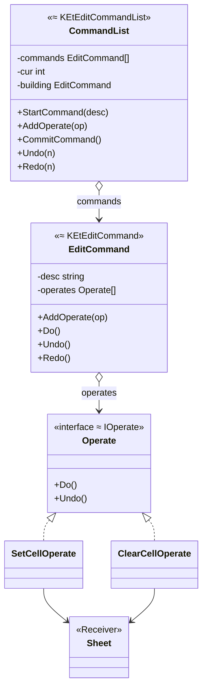

# 命令模式（Command Pattern）— Go 语言

用 ET（表格）编辑器的撤销 / 重做引擎来理解：

> **一次编辑 = 一个命令对象；命令里可以挂多个子操作。**  
> `StartCommand` → `AddOperate`… → `CommitCommand` 压栈。  
> `Undo` / `Redo` 移动当前指针，并对命令做逆序 / 正序回放。

对应 C++：`KEtEditCommand` / `KEtEditCommandList`（`command.h`）。

---

## 1. 和 ET 代码的映射

| C++（ET） | 本笔记 Go | 职责 |
|-----------|-----------|------|
| `IKEtCommand` / `KEtEditCommand` | `EditCommand` | 一次用户可见编辑 |
| `Undo` / `Redo` | `Undo` / `Redo` | 回退 / 重放本命令 |
| `AddOperate` | `AddOperate` | 挂子操作 |
| `m_OperateVector` | `operates []Operate` | 子操作列表 |
| `m_strDescriptions` | `desc` | UI 菜单文案 |
| `IKEtCommandList` / `KEtEditCommandList` | `CommandList` | 命令栈管理 |
| `StartCommand` / `CommitCommand` | 同名 | 开始收集 → 提交压栈 |
| `Undo(uStep)` / `Redo(uStep)` | `Undo(n)` / `Redo(n)` | 撤 / 重 N 步 |
| `m_nCurCommandID` | `cur` | 当前生效命令下标（-1=初始） |
| `CommandVect` | `commands` | 命令向量 |
| `IOperate` | `Operate` | 最小可逆改动 |

### 1.1 不会命令时（step1）

```go
sheet.SetCell("A1", "100")
sheet.SetCell("A1", "200") // 旧值丢了，无法 Ctrl+Z
```

### 1.2 会命令时（step2 / step3）

```text
StartCommand("填充表头")
  AddOperate(Set A1)
  AddOperate(Set B1)
  AddOperate(Set C1)
CommitCommand()     → 算 1 个 undo 步
Undo(1)             → 三个子操作逆序回退
```

### 1.3 演变目录（建议先跑）

| 步骤 | 目录 | 要体会的点 |
|------|------|------------|
| 1 | `evolve/step1_直接改文档无法撤销` | 当场改表，无历史 |
| 2 | `evolve/step2_命令与撤销栈` | Start/Commit + cur 指针 |
| 3 | `evolve/step3_命令含多子操作` | 一命令多 Operate；新 Operate 不改栈 |

```bash
cd evolve/step1_直接改文档无法撤销 && go run .
cd ../step2_命令与撤销栈 && go run .
cd ../step3_命令含多子操作 && go run .
```

最终形态见同级 `main.go`。

---

## 2. 定义

### 2.1 官方味道的定义

命令模式是一种**行为型**设计模式：将请求封装成对象，从而支持参数化、排队、日志，以及**可撤销**操作。

落到 ET / 本例：

| 模式角色 | 本例 | ET 对应 |
|----------|------|---------|
| Command | `EditCommand` | `KEtEditCommand` |
| Concrete「请求」 | `SetCellOperate` 等 | `IOperate` 实现 |
| Receiver | `Sheet` | 表格文档内核 |
| Invoker | `CommandList` + UI 的 Undo 按钮 | `KEtEditCommandList` |
| Client | `main` / 编辑手势代码 | 开始编辑的业务层 |

说明：教科书常把「按键」当 Invoker；编辑器里更常见的是 **CommandList 栈** 当总控，UI 只调 `Undo(1)`。

### 2.2 栈与 cur 指针（对齐 `m_nCurCommandID`）

```text
commands:  [ c0 ][ c1 ][ c2 ][ c3 ]
索引:         0     1     2     3
                          ↑
                         cur=2   ← 当前已生效到 c2；c3 在「重做分支」

Undo(1) → c2.Undo(); cur=1
Redo(1) → cur=2; c2.Redo()

若在 cur=1 时又 Commit 新命令 c_new：
  丢掉 c2、c3，变成 [c0][c1][c_new]，cur 指向 c_new
```

### 2.3 UML



结构速览：

```text
UI / 业务
  │ StartCommand / AddOperate / Commit / Undo / Redo
  ▼
CommandList ──commands──► EditCommand
                              │ operates[]
                              ▼
                           Operate.Do / Undo
                              │
                              ▼
                            Sheet
```

### 2.4 和「遥控器范例」差在哪（一句话）

遥控器强调「按键挂命令」；ET 强调「**命令栈 + 子操作列表 + 撤销指针**」——真实编辑器更接近后者。

---

## 3. 常见场景

| 场景 | 为什么适合 |
|------|------------|
| 办公套件 Undo/Redo | 一步编辑可能含多个内核修改 |
| 图形编辑器 | 移动+改样式绑成一命令 |
| IDE 文本编辑 | 输入/删除可合并或拆成命令 |
| 事务补偿 | Undo 当回滚 |

---

## 4. 示范代码（对齐 ET API）

完整可运行见同级 `main.go`。

### 4.1 子操作 Operate

```go
type Operate interface {
	Do()
	Undo()
}

type SetCellOperate struct {
	sheet                *Sheet
	addr, newValue, oldValue string
}

func NewSetCellOperate(sheet *Sheet, addr, newValue string) *SetCellOperate {
	return &SetCellOperate{
		sheet: sheet, addr: addr, newValue: newValue,
		oldValue: sheet.get(addr), // 修改前快照
	}
}
```

### 4.2 EditCommand（≈ KEtEditCommand）

```go
func (c *EditCommand) Undo() {
	for i := len(c.operates) - 1; i >= 0; i-- {
		c.operates[i].Undo() // 逆序，保证依赖正确回退
	}
}

func (c *EditCommand) Redo() {
	for _, op := range c.operates {
		op.Do()
	}
}
```

### 4.3 CommandList（≈ KEtEditCommandList）

```go
func (l *CommandList) CommitCommand() {
	if l.cur+1 < len(l.commands) {
		l.commands = l.commands[:l.cur+1] // 截断重做分支
	}
	cmd := l.building
	l.building = nil
	cmd.Do()
	l.commands = append(l.commands, cmd)
	l.cur = len(l.commands) - 1
}

func (l *CommandList) Undo(n int) {
	for i := 0; i < n && l.cur >= 0; i++ {
		l.commands[l.cur].Undo()
		l.cur--
	}
}
```

### 4.4 使用

```go
list.StartCommand("填充表头")
list.AddOperate(NewSetCellOperate(sheet, "A1", "姓名"))
list.AddOperate(NewSetCellOperate(sheet, "B1", "年龄"))
list.CommitCommand()

list.Undo(1)
list.Redo(1)
```

```bash
cd 设计模式/命令模式
go run .
```

---

## 5. 和「宏命令 / 组合」的关系（一句话）

`EditCommand` 里的 `operates` 本质上就是**宏命令**：对外一步 Undo，对内多个子操作。ET 把「命令」和「子操作」分成两层，方便复用 `IOperate`。

---

## 6. 总结

### 6.1 只记三句

1. **命令对象化**：一次编辑可压栈、可描述、可撤可重。
2. **命令 ≠ 最小改动**：`EditCommand` 含多个 `Operate`（ET 的 `m_OperateVector`）。
3. **栈 + cur**：`Undo`/`Redo` 移动指针；新 `Commit` 截断未来。

### 6.2 优缺点速查

| | |
|--|--|
| 优点 | 撤销/重做清晰；复合编辑原子回退；UI 可列描述 |
| 缺点 | 每类改动要能快照旧状态；命令/操作类型会变多；内存要限栈深（ET 有 `GetMaxUndoStep`） |

### 6.3 选型一句话

> 当「用户动作」需要撤销/重做，且一步里可能改多处时，用命令栈（ET 这套）；只是立刻调一个函数，不必上命令模式。
