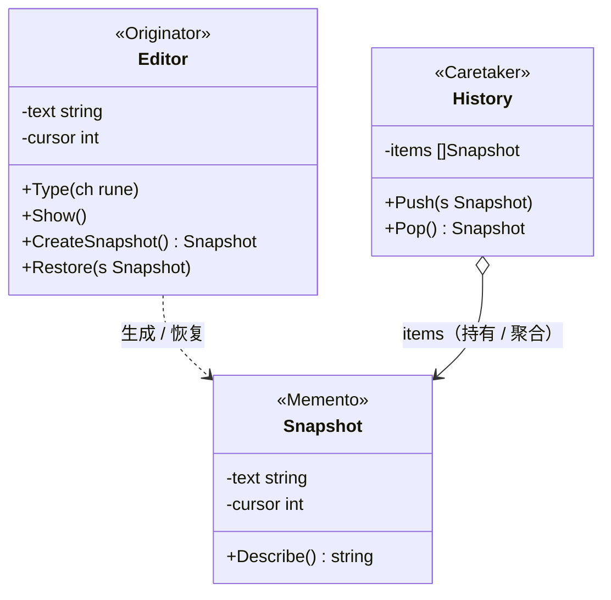

# 备忘录模式（Memento Pattern）— Go 语言

备忘录模式的核心一句话：

> **在不暴露对象内部结构的前提下，把「状态快照」取出来存到别处**——需要时再整体恢复回去。造快照的对象（Originator）与管理快照的对象（Caretaker）彼此不越界。

---

## 1. 定义

### 1.1 官方味道的定义

备忘录模式是一种**行为型**设计模式：在不破坏封装性的前提下，捕获一个对象的内部状态，并在该对象之外保存这个状态，以便将来能把对象恢复到先前保存的状态。

做法是：

1. **Originator（发起人）** 是那个要被备份的对象，它知道自己的状态，并能生成快照、从快照恢复。
2. **Memento（备忘录）** 是状态快照本体，把 Originator 的内部字段收成一份拷贝；对管理者而言它是「不透明」的。
3. **Caretaker（负责人）** 只负责存快照、取快照，不解读、也不修改快照内容。

### 1.2 角色关系（UML 类图）

以「文本编辑器撤销」为例（对应本目录代码）：



图例（对照教科书 UML）：

| 线 | UML 含义 | 在本例里 |
|----|----------|----------|
| `o→` 实线 | 聚合 / 持有 | `History` 用切片持有多个 `Snapshot` |
| `‥>` 虚线箭头 | 依赖（Dependency） | `Editor` 创建快照、按快照恢复 |

结构速览（和上面 UML 同一回事）：

```text
Editor（发起人）──生成──► Snapshot（备忘录）──存入──► History（负责人）
   ▲                                                │
   └────────────── 从快照恢复 ◄──────────────────────┘
```

要点：

- `Snapshot` 是一次**拷贝**：拿到快照之后再编辑 Editor，不会污染历史。
- `History` 只做 `Push` / `Pop`，它看不懂快照里是什么，也不需要看懂。
- 恢复是「整体替换当前状态」，而不是逐字段打补丁。

### 1.3 和「命令模式」差在哪（一句话）

命令模式把「一次可撤销的操作」打包成对象，撤销靠执行**相反的指令**；备忘录模式存的是**状态本身**，撤销靠整体恢复旧状态。编辑器撤销多用命令；如果你要的只是"回到某个时刻的样子"，备忘录更直接。两者也可以组合：命令里保存操作后快照用于撤销。

---

## 2. 常见场景

| 场景 | 为什么适合 |
|------|------------|
| 文档 / 编辑器撤销 | 每步编辑前存一份状态，Ctrl+Z 整体恢复 |
| 游戏存档 / 关卡检查点 | 玩家中途退出，恢复时回到上一检查点 |
| 事务 / 回滚 | 事务开始前快照配置，失败时整体回滚 |
| 设置恢复出厂 | 保存一组默认状态，一键还原 |
| 断点续传 | 保存处理进度，中断后从快照继续 |

Go 里更接地气的说法：

- 你不想把对象的内部字段全部 `export` 出去，但又需要"把状态存下来"。
- 你只要「回到某个时刻的样子」，不关心这中间具体发生了什么指令。
- 恢复历史这类能力希望加在客户端，而不改动被备份对象的接口。

此时用 Memento 把快照能力封装进去。

---

## 3. 示范代码

下面用「文本编辑器撤销」说明：编辑器生成快照，历史栈存快照，撤销时恢复快照。

### 3.1 角色：发起人（编辑器）

```go
package main

import "fmt"

// Editor 文本编辑器：持有正文与光标，可以生成快照、从快照恢复。
type Editor struct {
	text   string
	cursor int
}

// Type 输入一个字符（追加到末尾，光标后移）。
func (e *Editor) Type(ch rune) {
	e.text += string(ch)
	e.cursor++
}

func (e *Editor) Show() {
	fmt.Printf("  [Editor] 内容=%q 光标=%d\n", e.text, e.cursor)
}

// CreateSnapshot 生成当前状态快照（备忘录）。
// 只把必要字段拷进快照，后续继续编辑不会污染已有历史。
func (e *Editor) CreateSnapshot() *Snapshot {
	return &Snapshot{text: e.text, cursor: e.cursor}
}

// Restore 用一份快照整体恢复状态。
func (e *Editor) Restore(s *Snapshot) {
	e.text = s.text
	e.cursor = s.cursor
}
```

### 3.2 角色：备忘录（快照）

```go
// Snapshot 快照：字段对外隐藏，只留只读查看入口。
type Snapshot struct {
	text   string
	cursor int
}

// Describe 只读查看快照内容（便于演示；Caretaker 一般不需要解读）。
func (s *Snapshot) Describe() string {
	return fmt.Sprintf("内容=%q 光标=%d", s.text, s.cursor)
}
```

### 3.3 角色：负责人（历史栈）

```go
// History 撤销历史栈。
type History struct {
	items []*Snapshot
}

// Push 压入一份快照。
func (h *History) Push(s *Snapshot) {
	h.items = append(h.items, s)
}

// Pop 弹出最近一份快照；栈空返回 nil。
func (h *History) Pop() *Snapshot {
	if len(h.items) == 0 {
		return nil
	}
	last := h.items[len(h.items)-1]
	h.items = h.items[:len(h.items)-1]
	return last
}
```

### 3.4 使用方式

```go
func main() {
	e := &Editor{}
	hist := &History{}

	// 约定：每次「编辑之前」，先把当前状态存一份，作为撤销的锚点。
	// 这样弹出栈顶快照并恢复，就能真正回到上一步，而不是原地不动。
	hist.Push(e.CreateSnapshot())           // 存档 ①：空文档

	for _, r := range []rune("你好，世界") {
		e.Type(r)
	}
	e.Show()

	hist.Push(e.CreateSnapshot())           // 存档 ②：你好，世界

	for _, r := range []rune("！开始学设计模式") {
		e.Type(r)
	}
	e.Show()

	// 撤销一次：回到「你好，世界」；再撤销：回到空文档
	if s := hist.Pop(); s != nil {
		e.Restore(s)
	}
	fmt.Println("-- 撤销一次 --")
	e.Show()

	if s := hist.Pop(); s != nil {
		e.Restore(s)
	}
	fmt.Println("-- 再撤销 --")
	e.Show()

	// 第三次：历史已空，忽略
	if s := hist.Pop(); s != nil {
		e.Restore(s)
		e.Show()
	} else {
		fmt.Println("-- 第三次撤销：没有更早的历史，忽略 --")
	}
}
```

本目录完整可运行代码见同级 `main.go`：

```bash
cd 知识库/设计模式/行为型模式/备忘录模式
go run .
```

示例输出：

```text
  存档 ①： 内容="" 光标=0
  [Editor] 内容="你好，世界" 光标=5
  存档 ②： 内容="你好，世界" 光标=5
  [Editor] 内容="你好，世界！开始学设计模式" 光标=13
-- 撤销一次 --
  [Editor] 内容="你好，世界" 光标=5
-- 再撤销 --
  [Editor] 内容="" 光标=0
-- 第三次撤销 --
  没有更早的历史，忽略
```

### 3.5 调用链拆解

以「存档 → 编辑 → 撤销」为例：

```text
hist.Push(e.CreateSnapshot())        // 把当时的（空文档）状态拷成快照，压栈
   → 后续 e.Type(...) 改的是 e 自己，快照不受影响
hist.Pop()                           // 弹回最近一份快照 = 「你好，世界」
   → e.Restore(s)                    // 整体替换 text 与 cursor
```

关键是：**快照是值拷贝**。`text`、`cursor` 都是基础类型，`CreateSnapshot` 那一刻就已经独立；之后怎么编辑，过去的快照都保持原样。

### 3.6 Go 里的注意点

1. **同包封装的现实**：Go 里同 package 的字段本来就能直接访问，所以严格意义的「窄接口」要靠约定（快照字段小写 + 只读方法）模拟；跨 package 时才真正隔离。
2. **快照要存值还是引用**：若状态的字段是切片 / map / 指针，`CreateSnapshot` 里要**拷贝底层数据**，否则快照会跟着原件变。本例都是值类型，天然安全。
3. **谁触发存档**：示例是手动 `Push`；真实编辑器通常在「每次编辑动作之前」自动存档，避免漏掉锚点。
4. **内存成本**：每个快照都保存全部状态；文档很大时可结合差异存储/压缩，这些交给 History，不改 Editor。

---

## 4. 总结

### 4.1 记住三件事

1. **意图**：把「存状态 / 回状态」的能力封装给对象自己，外部只存不读。
2. **机制**：Originator 生成与恢复快照；Memento 是一份不透明拷贝；Caretaker 只管存取。
3. **适用边界**：需要「回到某个时刻的样子」，且不想暴露内部结构时香；状态庞大或变化极快时，注意快照成本。

### 4.2 优缺点速查

| | 说明 |
|---|------|
| 优点 | 恢复的是整体状态，简单可靠；封装性不被破坏 |
| 优点 | 历史管理（重做、压缩）可以加在 Caretaker 侧，不动 Originator |
| 缺点 | 每份快照都可能占用内存；拷大对象成本高 |
| 缺点 | Originator 与快照结构耦合，改字段时两个地方都要动 |

### 4.3 选型一句话

> 需要「存下状态、随时整体回退」且不想暴露内部细节时，用备忘录；如果撤销粒度是「某个具体动作」，命令模式可能更合适。