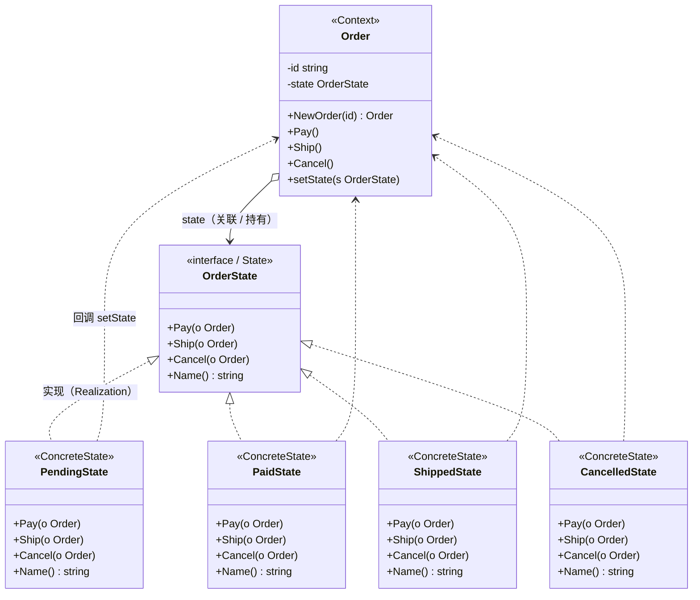

# 状态模式（State Pattern）— Go 语言

状态模式的核心一句话：

> **把「随状态变化的行为」拆到各个 State 类型里**——Context 只持有当前状态并转发请求，合法转换由具体状态自己完成。

---

## 1. 定义

### 1.1 官方味道的定义

状态模式是一种**行为型**设计模式：允许对象在内部状态改变时改变它的行为，看起来仿佛修改了类。

做法是：

1. Context（上下文）持有一个当前 `State` 引用，对外暴露业务方法。
2. State（状态）接口声明所有「与状态相关」的动作。
3. 每个 ConcreteState 实现这些动作：合法时切换状态，非法时拒绝。

### 1.2 角色关系（UML 类图）

软件工程里常见的「接口实现 + 关联」画法（对应本例订单代码）：



图例（对照教科书 UML）：

| 线 | UML 含义 | 在本例里 |
|----|----------|----------|
| `◁‥` 虚线空心三角 | 实现接口（Realization） | `PendingState` 等实现 `OrderState`（Go 里无 `extends`，靠方法集满足接口） |
| `◆→` / `o→` 实线 | 关联 / 聚合 | `Order` 持有当前 `state` |
| `‥>` 虚线箭头 | 依赖（Dependency） | 具体状态方法里拿到 `*Order`，调用 `setState` 完成切换 |

结构速览（和上面 UML 同一回事）：

```text
Client
  │  Pay() / Ship() / Cancel()
  ▼
Order（Context）────持有────► OrderState（接口）
                                 △ 实现
                    ┌────────────┼────────────┬────────────┐
                    │            │            │            │
              PendingState  PaidState  ShippedState  CancelledState
```

要点：

- Client 只跟 `Order` 说话，不直接操作各个 State。
- 切换状态时，通常由**当前 ConcreteState** 调用 Context 的 `setState`。
- Context 里没有「`if` 当前是 Pending 就……」的大分支。
- Go 没有类继承；图里的「继承类似」关系，在代码里就是**实现接口**（Realization），不是 `extends`。

### 1.3 和「策略模式」差在哪（一句话）

策略通常由外部选定算法，切换往往是主动替换；状态的转换规则常写在状态内部，形成一个状态机。课堂里先按「状态机」理解即可。

---

## 2. 常见场景

| 场景 | 为什么适合 |
|------|------------|
| 订单 / 工单生命周期 | 待支付、已支付、已发货等；同一动作在不同阶段含义不同 |
| TCP / 连接会话 | Closed、Listening、Established；事件驱动的合法转换表 |
| 审批流 | 草稿、待审、通过、驳回；操作权限随状态变 |
| 媒体播放器 | Stopped / Playing / Paused；按键语义依赖当前状态 |
| 游戏角色状态 | 站立、奔跑、跳跃、受伤；输入在不同状态映射不同行为 |

Go 里更接地气的说法：

- 同一个对象上，一堆 `if status == ...` 已经开始互相踩脚。
- 状态种类会增，每种状态下的规则最好各自改、各自测。
- 你希望「非法操作」有明确落点，而不是散落在 Context 各处。

此时用 State 把每个状态收成独立类型，转换表更清晰。

---

## 3. 示范代码

下面用「电商订单」说明：对外动作是支付 / 发货 / 取消；状态决定动作是否合法、转到哪里。

### 3.1 状态转换表

| 当前状态 | Pay | Ship | Cancel |
|----------|-----|------|--------|
| Pending（待支付） | → Paid | 拒绝 | → Cancelled |
| Paid（已支付） | 拒绝 | → Shipped | → Cancelled |
| Shipped（已发货） | 拒绝 | 拒绝 | 拒绝 |
| Cancelled（已取消） | 拒绝 | 拒绝 | 拒绝 |

```text
Pending  --Pay--> Paid --Ship--> Shipped
   |                |
 Cancel           Cancel
   v                v
Cancelled <---------+
```

### 3.2 State 接口与 Context

```go
package main

import "fmt"

// OrderState：某一状态下，对 Pay / Ship / Cancel 的行为约定。
type OrderState interface {
	Pay(o *Order)
	Ship(o *Order)
	Cancel(o *Order)
	Name() string
}

// Order：上下文，持有当前状态并转发请求。
type Order struct {
	id    string
	state OrderState
}

func NewOrder(id string) *Order {
	o := &Order{id: id}
	o.setState(&PendingState{})
	return o
}

func (o *Order) setState(s OrderState) {
	o.state = s
	fmt.Printf("[Order %s] 当前状态 → %s\n", o.id, s.Name())
}

func (o *Order) Pay()    { o.state.Pay(o) }
func (o *Order) Ship()   { o.state.Ship(o) }
func (o *Order) Cancel() { o.state.Cancel(o) }
```

### 3.3 具体状态：待支付 / 已支付

```go
// PendingState：待支付。
type PendingState struct{}

func (s *PendingState) Name() string { return "Pending(待支付)" }

func (s *PendingState) Pay(o *Order) {
	fmt.Printf("  [Pay] 订单 %s 支付成功\n", o.id)
	o.setState(&PaidState{})
}

func (s *PendingState) Ship(o *Order) {
	fmt.Printf("  [Ship] 拒绝：订单 %s 仍待支付，不能发货\n", o.id)
}

func (s *PendingState) Cancel(o *Order) {
	fmt.Printf("  [Cancel] 订单 %s 已取消（未支付）\n", o.id)
	o.setState(&CancelledState{})
}

// PaidState：已支付。
type PaidState struct{}

func (s *PaidState) Name() string { return "Paid(已支付)" }

func (s *PaidState) Pay(o *Order) {
	fmt.Printf("  [Pay] 拒绝：订单 %s 已支付，勿重复付款\n", o.id)
}

func (s *PaidState) Ship(o *Order) {
	fmt.Printf("  [Ship] 订单 %s 已发货\n", o.id)
	o.setState(&ShippedState{})
}

func (s *PaidState) Cancel(o *Order) {
	fmt.Printf("  [Cancel] 订单 %s 已取消（退款流程略）\n", o.id)
	o.setState(&CancelledState{})
}
```

### 3.4 具体状态：已发货 / 已取消（终态）

```go
// ShippedState：已发货（终态）。
type ShippedState struct{}

func (s *ShippedState) Name() string { return "Shipped(已发货)" }

func (s *ShippedState) Pay(o *Order) {
	fmt.Printf("  [Pay] 拒绝：订单 %s 已发货\n", o.id)
}

func (s *ShippedState) Ship(o *Order) {
	fmt.Printf("  [Ship] 拒绝：订单 %s 已发货\n", o.id)
}

func (s *ShippedState) Cancel(o *Order) {
	fmt.Printf("  [Cancel] 拒绝：订单 %s 已发货，不能取消\n", o.id)
}

// CancelledState：已取消（终态）。
type CancelledState struct{}

func (s *CancelledState) Name() string { return "Cancelled(已取消)" }

func (s *CancelledState) Pay(o *Order) {
	fmt.Printf("  [Pay] 拒绝：订单 %s 已取消\n", o.id)
}

func (s *CancelledState) Ship(o *Order) {
	fmt.Printf("  [Ship] 拒绝：订单 %s 已取消\n", o.id)
}

func (s *CancelledState) Cancel(o *Order) {
	fmt.Printf("  [Cancel] 拒绝：订单 %s 已取消\n", o.id)
}
```

### 3.5 使用方式

```go
func main() {
	// 路径 1：支付 → 发货 → 再试取消（应拒绝）
	o1 := NewOrder("A100")
	o1.Pay()
	o1.Ship()
	o1.Cancel()

	// 路径 2：待支付直接取消 → 再试支付（应拒绝）
	o2 := NewOrder("B200")
	o2.Cancel()
	o2.Pay()
}
```

本目录完整可运行代码见同级 `main.go`：

```bash
cd server_study/设计模式/状态模式
go run .
```

示例输出：

```text
========== 路径 1：支付 → 发货 → 再试取消（应拒绝）==========
[Order A100] 当前状态 → Pending(待支付)
  [Pay] 订单 A100 支付成功
[Order A100] 当前状态 → Paid(已支付)
  [Ship] 订单 A100 已发货
[Order A100] 当前状态 → Shipped(已发货)
  [Cancel] 拒绝：订单 A100 已发货，不能取消

========== 路径 2：待支付直接取消 → 再试支付（应拒绝）==========
[Order B200] 当前状态 → Pending(待支付)
  [Cancel] 订单 B200 已取消（未支付）
[Order B200] 当前状态 → Cancelled(已取消)
  [Pay] 拒绝：订单 B200 已取消
```

### 3.6 调用链拆解

以「A100 支付」为例：

```text
o1.Pay()
  → o1.state.Pay(o1)          // 当前 state 是 *PendingState
      → 打印支付成功
      → o1.setState(&PaidState{})   // 状态对象自己触发切换
```

同一条 `o1.Ship()`：

```text
o1.Ship()
  → 此时 state 已是 *PaidState
      → PaidState.Ship → setState(Shipped)
```

若在 Shipped 后再 `Cancel`，进的是 `ShippedState.Cancel`，只拒绝、不切换。

### 3.7 Go 里的注意点

1. **状态要不要做成单例**：本示例每次 `setState(&PaidState{})` 新建值；状态无额外字段时也可复用包级变量，减少分配。
2. **谁负责切状态**：常见两种——ConcreteState 调 `setState`（本例），或 State 方法返回下一个状态由 Context 统一设置。课堂推荐先掌握本例写法。
3. **非法操作怎么处理**：示例用日志拒绝；生产里可返回 `error`，由上层决定提示或重试。
4. **别和枚举 + switch 对立**：状态很少、转换极简单时，`switch status` 往往够用；状态与规则变多时，再拆成 State 类型更划算。

---

## 4. 总结

### 4.1 记住三件事

1. **意图**：行为随状态变；把分支从 Context 挪到各个 State。
2. **机制**：Context 转发 + ConcreteState 实现动作并（在合法时）切换状态。
3. **适用边界**：状态多、转换规则清晰时香；只有两三个状态且很少变时，不必上模式。

### 4.2 优缺点速查

| | 说明 |
|---|------|
| 优点 | 消除 Context 里巨大的状态分支；单状态规则内聚，好读也好测 |
| 优点 | 新增状态 = 新类型；改某一状态行为不必翻遍所有 `if` |
| 缺点 | 状态 / 接口数量变多，简单场景容易过度设计 |
| 缺点 | 状态之间可能互相知道对方类型（切换时 `new` 具体状态），耦合需控制 |
| 缺点 | 若状态转换表本身极不稳定，拆类也救不了「需求天天改表」的成本 |

### 4.3 选型一句话

> 对象有一张清楚的状态转换表，且同一动作在不同状态下含义不同时，用状态模式；若只是两三个 flag，直接 `switch` 更诚实。
