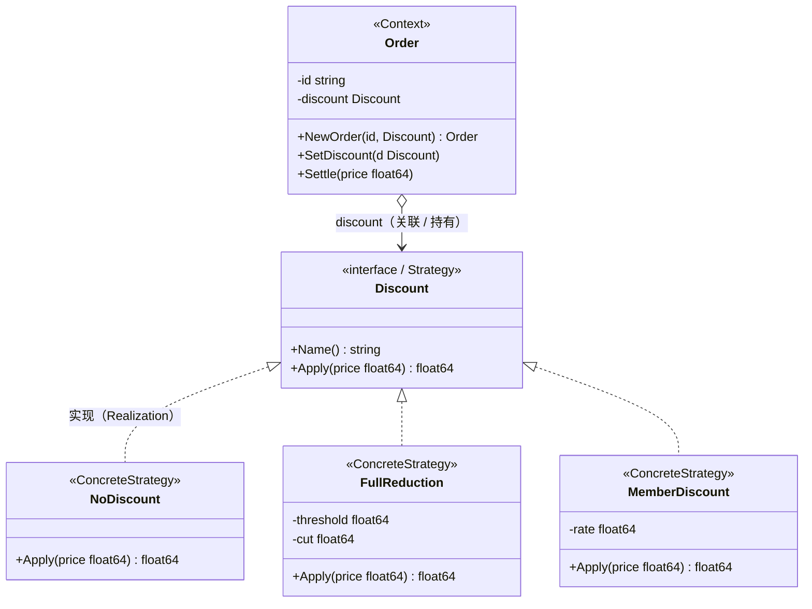

# 策略模式（Strategy Pattern）— Go 语言

策略模式的核心一句话：

> **把「可替换的算法」各自封装成独立的策略类型**——Context 只持有当前策略并转发请求，运行时想换就换，调用方完全无感。

---

## 1. 定义

### 1.1 官方味道的定义

策略模式是一种**行为型**设计模式：定义一系列算法，把它们一个个封装起来，并且使它们可以相互替换。本模式让算法的变化独立于使用它的客户。

做法是：

1. **Strategy（策略）** 是一个接口，声明所有算法共用的入口。
2. **ConcreteStrategy（具体策略）** 各自实现同一种能力的「一种做法」。
3. **Context（上下文）** 持有一个 `Strategy`，把请求转发给它；换算法 = 换对象，Context 本身的逻辑一行不改。

### 1.2 角色关系（UML 类图）

软件工程里常见的「接口实现 + 关联」画法（对应本例电商折扣代码）：



图例（对照教科书 UML）：

| 线 | UML 含义 | 在本例里 |
|----|----------|----------|
| `◁‥` 虚线空心三角 | 实现接口（Realization） | `NoDiscount` 等实现 `Discount`（Go 里靠方法集满足接口） |
| `o→` 实线 | 关联 / 聚合 | `Order` 持有当前 `discount` 策略 |

结构速览（和上面 UML 同一回事）：

```text
Client
  │  Settle(320) / SetDiscount(...)
  ▼
Order（Context）────持有────► Discount（接口）
                                 △ 实现
                  ┌──────────────┼───────────────┐
                  │              │               │
            NoDiscount     FullReduction    MemberDiscount
```

要点：

- Client 只跟 `Order` 说话，不直接触碰各种策略。
- 换算法发生在运行时：`SetDiscount` 替换的是 `Order` 内部持有的对象。
- Context 里没有 `if 会员就…… if 满300就……` 的大分支。
- 策略对象可以自带参数（满减门槛、折扣率），构造时注入，天然支持可配置。

### 1.3 和「状态模式」差在哪（一句话）

状态模式里，行为变化来自**对象自身的状态切换**，下一步去哪由状态对象自己决定；策略模式里，算法由**外部挑选并注入**，Context 只是「用它」。课堂先记：状态偏「状态机」，策略偏「换算法」。

---

## 2. 常见场景

| 场景 | 为什么适合 |
|------|------------|
| 电商/计费规则 | 无优惠、满减、会员折；规则可配置、可叠加 |
| 支付方式选型 | 微信 / 支付宝 / 银行卡，结算入口不变 |
| 出行规划 | 公交 / 驾车 / 步行，同一「规划接口」 |
| 排序与压缩 | 冒泡 / 快排 / 归并，或 zip / gzip / 7z，算法可换 |
| 校验规则 | 邮箱格式、长度、黑名单，校验策略列表 |

Go 里更接地气的说法：

- 一处 `switch case` 里已经塞了七八种算法，每种又带自己的参数。
- 你希望新来一种算法时，只新增一个类型，老代码不动。
- 你希望算法的选择/组合能放到配置层，而不是写死在业务代码里。

此时用 Strategy 把每种做法收成独立类型，Context 统一调用。

---

## 3. 示范代码

下面用「电商促销折扣」说明：对外动作是结算；到底按哪种优惠算钱，由当前策略决定。

### 3.1 策略接口与上下文

```go
package main

import "fmt"

// Discount 折扣策略：对原价应用一种计价规则，返回最终应付。
type Discount interface {
	Name() string
	Apply(price float64) float64
}

// Order 订单上下文：持有当前折扣策略。
type Order struct {
	id       string
	discount Discount
}

func NewOrder(id string, d Discount) *Order {
	if d == nil {
		d = &NoDiscount{}
	}
	return &Order{id: id, discount: d}
}

// SetDiscount 运行时切换折扣策略。
func (o *Order) SetDiscount(d Discount) {
	o.discount = d
}

// Settle 结算：原价交给当前策略计算。
func (o *Order) Settle(price float64) {
	final := o.discount.Apply(price)
	fmt.Printf("[订单 %s] 原价 %.0f → %s 后：%.0f\n", o.id, price, o.discount.Name(), final)
}
```

### 3.2 三种具体策略

```go
// NoDiscount 无折扣：原价直付。
type NoDiscount struct{}

func (d *NoDiscount) Name() string            { return "无折扣" }
func (d *NoDiscount) Apply(p float64) float64 { return p }

// FullReduction 满减：满 threshold 元减 cut 元。
type FullReduction struct {
	threshold float64
	cut       float64
}

func (d *FullReduction) Name() string { return fmt.Sprintf("满%.0f减%.0f", d.threshold, d.cut) }

func (d *FullReduction) Apply(p float64) float64 {
	if p >= d.threshold {
		return p - d.cut
	}
	return p
}

// MemberDiscount 会员折：按比例打折（rate 0.9 表示九折）。
type MemberDiscount struct {
	rate float64
}

func (d *MemberDiscount) Name() string { return fmt.Sprintf("会员%.0f折", d.rate*10) }

func (d *MemberDiscount) Apply(p float64) float64 { return p * d.rate }
```

### 3.3 使用方式

```go
func main() {
	// 同一笔订单：先按无折扣结算，再运行时切成满减、会员折各算一次。
	o := NewOrder("A100", &NoDiscount{})
	o.Settle(320) // 原价 320

	o.SetDiscount(&FullReduction{threshold: 300, cut: 50})
	o.Settle(320) // 满 300 减 50 → 270

	o.SetDiscount(&MemberDiscount{rate: 0.9})
	o.Settle(320) // 九折 → 288
}
```

本目录完整可运行代码见同级 `main.go`：

```bash
cd 知识库/设计模式/行为型模式/策略模式
go run .
```

示例输出：

```text
[订单 A100] 原价 320 → 无折扣 后：320
[订单 A100] 原价 320 → 满300减50 后：270
[订单 A100] 原价 320 → 会员9折 后：288
```

### 3.4 调用链拆解

以「切成满减后结算」为例：

```text
o.SetDiscount(&FullReduction{threshold: 300, cut: 50})
o.Settle(320)
  → o.discount.Apply(320)      // 当前策略已被替换成 *FullReduction
      → 320 >= 300，返回 320 - 50 = 270
```

再切成会员折：

```text
o.SetDiscount(&MemberDiscount{rate: 0.9})
o.Settle(320)
  → o.discount.Apply(320)      // 现在策略是 *MemberDiscount，同一行 Settle 逻辑
      → 返回 320 * 0.9 = 288
```

不管策略换成谁，`Settle` 里永远只有一句 `o.discount.Apply(price)`。

### 3.5 Go 里的注意点

1. **策略对象要不要带状态**：本例每个策略都是「参数化数据」（门槛、折扣率），构造时注入即可；若策略本身需要共享，也可做成包级单例。
2. **nil 策略兜底**：`NewOrder` 里 `nil` 时回退为 `NoDiscount`，避免 Context 里处处判空。
3. **策略的颗粒度**：一个 Discount 只负责「算一个价」；若需要叠加多种优惠（满减 → 再会员折），可让策略内部组合装另一个策略，或引入装饰器，别把多种规则塞进一个 Apply。
4. **别和 switch + enum 对立**：算法就一两种、几乎不变时，`switch` 更诚实；算法会增、参数各异时，再拆策略。

---

## 4. 总结

### 4.1 记住三件事

1. **意图**：算法族各自封装成策略，运行时替换，算法变化独立于使用方。
2. **机制**：Context 持有接口 + 转发；具体策略实现接口；换算法即是换对象。
3. **适用边界**：同一行为有多种做法、且会增或会换时香；只有一种做法时不必上模式。

### 4.2 优缺点速查

| | 说明 |
|---|------|
| 优点 | 消灭 Context 里的算法大分支；每种算法内聚、好测 |
| 优点 | 运行时切换；新增算法 = 新类型，开闭原则友好 |
| 缺点 | 策略/接口数量变多，简单场景容易过度设计 |
| 缺点 | 客户端需要知道有哪些策略可选（本示例由调用方 `SetDiscount` 选择） |

### 4.3 选型一句话

> 同一件事有「多种做法」，且做法需要能替换、能扩展时，用策略模式；如果只有一种做法，直接写进方法里更诚实。