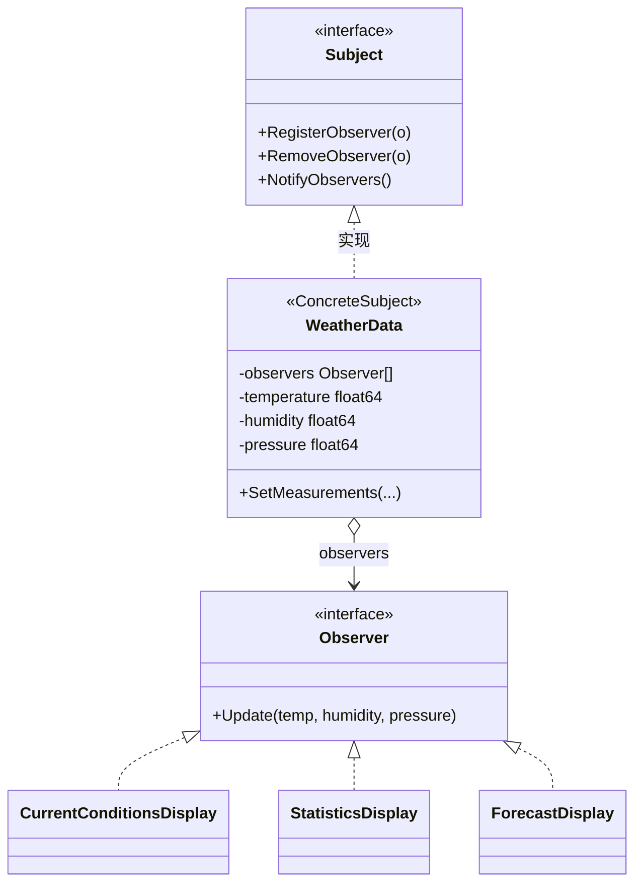

# 观察者模式（Observer Pattern）— Go 语言

换一种说法（先别背角色名）：

> **气象站一变，多块看板自己刷。**  
> 站不认识「当前状况 / 统计 / 预报」具体类型，只握着一串观察者。  
> 看板自己来注册，站只负责 `Notify`。

---

## 1. 用一张表想清楚

| | 当前状况看板 | 统计看板 | 预报看板（以后再加） |
|---|---|---|---|
| **读数变了要刷新** | 要 | 要 | 要 |

### 1.1 不会观察者时（step1）

`WeatherData.measurementsChanged` 里写死：

```go
w.current.Update(...)
w.stats.Update(...)
// 再加预报？只能改 WeatherData
```

气象站和每一个看板类型粘死；插拔、扩展都要动主题。

### 1.2 会观察者时（step2 / step3）

- 主题只认 `Observer` 接口 → `Register` / `Remove` / `Notify`
- 看板各自实现 `Update`，构造时自己注册
- 加预报看板 = 新类型 + `Register`，**主题代码不动**

```text
WeatherData.NotifyObservers()
  → current.Update(...)
  → stats.Update(...)
  → forecast.Update(...)   // step3 新加，主题循环不用改
```

### 1.3 演变目录（建议先跑）

| 步骤 | 目录 | 要体会的点 |
|------|------|------------|
| 1 | `evolve/step1_写死通知看板` | 主题点名调具体看板 |
| 2 | `evolve/step2_观察者接口` | 列表 + 广播；可注销 |
| 3 | `evolve/step3_只加新看板` | 只加 `ForecastDisplay`，主题不动 |

```bash
cd evolve/step1_写死通知看板 && go run .
cd ../step2_观察者接口 && go run .
cd ../step3_只加新看板 && go run .
```

最终形态与 step3 同思路，多演示一次注销，见同级 `main.go`。

---

## 2. 定义

### 2.1 官方味道的定义

观察者模式是一种**行为型**设计模式：定义对象间的一对多依赖，当一个对象状态改变时，所有依赖者都会收到通知并自动更新。

落到本例：

| 模式角色 | 本例 | 生活对应 |
|----------|------|----------|
| Subject | `Subject` / `WeatherData` | 气象站（数据一变就喊） |
| Observer | `Observer` | 「听广播的设备」接口 |
| ConcreteObserver | `CurrentConditionsDisplay` 等 | 具体看板 |

本笔记用 **Push**：`Update(temp, humidity, pressure)` 把数据推过去。  
还有一种 **Pull**：`Update()` 后观察者再问主题要字段——接口更稳，但观察者要持有主题引用。先抓 Push 即可。

### 2.2 UML（只看「主题握着观察者列表」）



图例：

| 线 | UML 含义 | 在本例里 |
|----|----------|----------|
| `◁‥` | 实现接口 | 看板实现 `Observer`；`WeatherData` 实现 `Subject` |
| `o→` | 聚合 | `WeatherData.observers` 里是 `Observer` |

结构速览：

```text
Client
  │  SetMeasurements / Register
  ▼
WeatherData（Subject）──observers──► Observer（接口）
                                      △ 实现
                         ┌────────────┼────────────┐
                         │            │            │
                   CurrentConditions Statistics  Forecast
```

要点：

- Client 把看板挂到主题上，之后只改读数。
- 主题遍历列表调用 `Update`，**不出现**具体看板类型名。
- Go 用方法集满足接口，没有 `extends`。

### 2.3 和「回调 / 事件」差在哪（一句话）

观察者是教科书里的一对多通知结构；语言里的回调、事件、信号槽，往往是同一种**意图**的方言。先会手写 Subject / Observer，再对照框架就好认。

---

## 3. 常见场景

| 场景 | 为什么适合 |
|------|------------|
| UI 数据绑定 | Model 变了，多个 View 刷新 |
| 事件总线 / 发布订阅 | 发布者不认识具体订阅者 |
| 日志 / 监控钩子 | 业务状态变了，多方旁路处理 |
| 股票 / 行情看板 | 同一行情源，多块屏 |
| 配置热更新 | 配置中心变了，各模块重载 |

Go 里更接地气的说法：

- 一处状态变了，好几处要跟着动，又不想互相 import 具体类型。
- 监听方数量会变，要能运行时挂上 / 摘掉。

---

## 4. 示范代码

完整可运行见同级 `main.go`（三块看板 + 注销演示）。

### 4.1 接口与主题

```go
type Observer interface {
	Update(temp, humidity, pressure float64)
}

type Subject interface {
	RegisterObserver(o Observer)
	RemoveObserver(o Observer)
	NotifyObservers()
}

type WeatherData struct {
	observers   []Observer
	temperature float64
	humidity    float64
	pressure    float64
}

func (w *WeatherData) NotifyObservers() {
	for _, o := range w.observers {
		o.Update(w.temperature, w.humidity, w.pressure)
	}
}

func (w *WeatherData) SetMeasurements(temp, humidity, pressure float64) {
	w.temperature = temp
	w.humidity = humidity
	w.pressure = pressure
	w.NotifyObservers()
}
```

### 4.2 具体观察者（构造时自行注册）

```go
type CurrentConditionsDisplay struct {
	temp, humidity float64
}

func NewCurrentConditionsDisplay(s Subject) *CurrentConditionsDisplay {
	d := &CurrentConditionsDisplay{}
	s.RegisterObserver(d)
	return d
}

func (d *CurrentConditionsDisplay) Update(temp, humidity, pressure float64) {
	d.temp, d.humidity = temp, humidity
	fmt.Printf("  [当前状况] 温度=%.1f°C 湿度=%.1f%%\n", d.temp, d.humidity)
}
```

统计、预报同理：实现 `Update`，`NewXxxDisplay(s)` 里 `Register`。

### 4.3 使用

```go
func main() {
	wd := NewWeatherData()
	_ = NewCurrentConditionsDisplay(wd)
	stats := NewStatisticsDisplay(wd)
	_ = NewForecastDisplay(wd)

	wd.SetMeasurements(26.5, 65, 1013.2)
	wd.RemoveObserver(stats)
	wd.SetMeasurements(25.0, 62, 1013.5)
}
```

```bash
cd 设计模式/观察者模式
go run .
```

---

## 5. 和「发布-订阅」差在哪（一句话）

- **观察者**：主题直接握着观察者引用（本笔记这版）。
- **发布-订阅**：中间往往多一个通道 / 事件总线，发布与订阅双方更解耦。

课堂 / 自学先把「列表 + Notify」跑通；总线是同族升级，不是另一套宇宙。

---

## 6. 总结

### 6.1 只记三句

1. **一对多**：一个主题，多个观察者。
2. **主题只认接口**：`Notify` 里没有具体看板类型名。
3. **加观察者不用改主题**：step3 的体感。

### 6.2 优缺点速查

| | |
|--|--|
| 优点 | 松耦合；运行时插拔；符合开闭（对加观察者） |
| 缺点 | 通知顺序难保证；一环慢可能拖住广播；乱注册易泄漏（忘 `Remove`） |

### 6.3 选型一句话

> 当「一个对象状态变了，多个未知对象要同步反应」，且监听方还可能增减时，用观察者；只有一处死跟随时，直接调函数就够。
