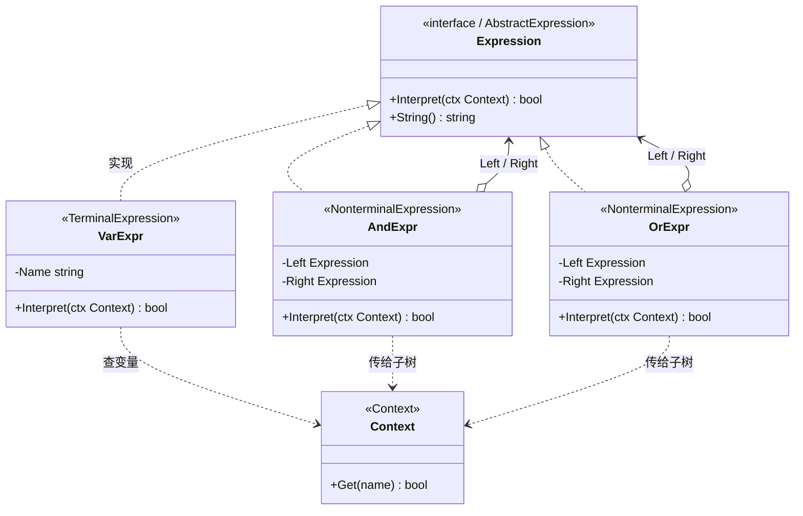

# 解释器模式（Interpreter Pattern）— Go 语言

解释器模式的核心一句话：

> **为一种简单「语言 / 规则」定义文法，并把每条文法做成 Expression 类型**——解释就是在 Context 上递归求值整棵表达式树。

---

## 1. 定义

### 1.1 官方味道的定义

解释器模式是一种**行为型**设计模式：给定一门语言，定义它的文法表示，并定义一个解释器，用该表示来解释语言中的句子。

做法是：

1. 把文法里的每一种构造映射成一个类（终端 / 非终端表达式）。
2. 所有表达式实现统一的 `Interpret(context)`。
3. 「一句话」对应一棵表达式对象树（AST）；解释 = 从根递归求值。

### 1.2 角色关系（UML 类图）



图例：

| 线 | UML 含义 | 在本例里 |
|----|----------|----------|
| `◁‥` | 实现接口 | `VarExpr` / `AndExpr` / `OrExpr` 实现 `Expression` |
| `o→` | 组合 / 聚合 | `And` / `Or` 持有左右子表达式 |
| `‥>` | 依赖 | 终端从 `Context` 读变量；非终端把 `Context` 传给子树 |

结构速览：

```text
Client 组装 AST
  │
  ▼
Expression（接口）──Interpret(ctx)──► bool
  │
  ├── VarExpr（终端）──查──► Context
  ├── AndExpr（非终端）──持有──► Left / Right Expression
  └── OrExpr（非终端）──持有──► Left / Right Expression
```

要点：

- **终端表达式**：不再拆分，直接出结果（本例是变量）。
- **非终端表达式**：由子表达式组成，解释时先解释孩子再组合。
- 本例 AST **手写组装**；真正从字符串解析还要词法 / 语法分析，那是另一门课。

### 1.3 和「随便写个递归函数」差在哪（一句话）

模式强调：文法规则 ↔ 类型一一对应，扩展新语法节点 = 新类型；简单一次性脚本不必硬套。

---

## 2. 常见场景

| 场景 | 为什么适合 |
|------|------------|
| 规则引擎 / 准入条件 | `vip AND (score OR staff)` 一类布尔组合，规则可变 |
| 简易配置 DSL | 过滤表达式、权限表达式，节点种类有限 |
| 教学向计算器 | `数字 / + / -` 组成表达式树再求值 |
| SQL / 正则的「思想远亲」 | 真实引擎远比教科书 Interpreter 复杂，但「AST + 求值」同源 |
| 报表公式 | 字段引用 + 四则运算节点 |

Go 里更接地气的说法：

- 有一套**封闭、小规模**的规则语法。
- 想用对象树表示规则，换数据（Context）就能反复解释。
- 不值得上完整编译器工具链时，手写几类 Expression 就够。

语法巨大或要高性能时，别用经典 Interpreter 硬撑，考虑专用解析器 / 字节码 / 现成规则引擎。

---

## 3. 示范代码

业务规则：

```text
vip AND (score OR staff)
```

含义：是会员，且（高分 **或** 内部员工）才放行。

### 3.1 文法（本例）

```text
expr := var | AND | OR
var  := 变量名（从 Context 取值）
AND  := left AND right
OR   := left OR right
```

对应类型：`VarExpr` / `AndExpr` / `OrExpr`。

### 3.2 Context 与 Expression 接口

```go
package main

import "fmt"

// Context：解释环境（变量表）。
type Context map[string]bool

func (c Context) Get(name string) bool {
	return c[name]
}

// Expression：抽象表达式。
type Expression interface {
	Interpret(ctx Context) bool
	String() string
}
```

### 3.3 终端：变量

```go
// VarExpr：查 Context。
type VarExpr struct {
	Name string
}

func (e *VarExpr) Interpret(ctx Context) bool {
	v := ctx.Get(e.Name)
	fmt.Printf("  [Var] %s = %v\n", e.Name, v)
	return v
}

func (e *VarExpr) String() string { return e.Name }
```

### 3.4 非终端：AND / OR

```go
// AndExpr：左 AND 右（左边 false 可短路）。
type AndExpr struct {
	Left, Right Expression
}

func (e *AndExpr) Interpret(ctx Context) bool {
	fmt.Printf("  [And] 解释 (%s) AND (%s)\n", e.Left, e.Right)
	l := e.Left.Interpret(ctx)
	if !l {
		fmt.Printf("  [And] 左为 false，短路 → false\n")
		return false
	}
	r := e.Right.Interpret(ctx)
	fmt.Printf("  [And] %v AND %v → %v\n", l, r, l && r)
	return l && r
}

func (e *AndExpr) String() string {
	return fmt.Sprintf("(%s AND %s)", e.Left, e.Right)
}

// OrExpr：左 OR 右（左边 true 可短路）。
type OrExpr struct {
	Left, Right Expression
}

func (e *OrExpr) Interpret(ctx Context) bool {
	fmt.Printf("  [Or] 解释 (%s) OR (%s)\n", e.Left, e.Right)
	l := e.Left.Interpret(ctx)
	if l {
		fmt.Printf("  [Or] 左为 true，短路 → true\n")
		return true
	}
	r := e.Right.Interpret(ctx)
	fmt.Printf("  [Or] %v OR %v → %v\n", l, r, l || r)
	return l || r
}

func (e *OrExpr) String() string {
	return fmt.Sprintf("(%s OR %s)", e.Left, e.Right)
}
```

### 3.5 组装规则树并解释

```go
func buildRule() Expression {
	// vip AND (score OR staff)
	return &AndExpr{
		Left: &VarExpr{Name: "vip"},
		Right: &OrExpr{
			Left:  &VarExpr{Name: "score"},
			Right: &VarExpr{Name: "staff"},
		},
	}
}

func main() {
	rule := buildRule()
	fmt.Println("规则树:", rule)

	ctx1 := Context{"vip": true, "score": false, "staff": true}
	fmt.Println("用例1:", rule.Interpret(ctx1)) // true

	ctx2 := Context{"vip": true, "score": false, "staff": false}
	fmt.Println("用例2:", rule.Interpret(ctx2)) // false

	ctx3 := Context{"vip": false, "score": true, "staff": true}
	fmt.Println("用例3:", rule.Interpret(ctx3)) // false（AND 短路）
}
```

本目录完整可运行代码见同级 `main.go`：

```bash
cd server_study/设计模式/解释器模式
go run .
```

示例输出（节选）：

```text
规则树: (vip AND (score OR staff))

========== 用例 1：vip=true, score=false, staff=true → 应 true ==========
  [And] 解释 (vip) AND ((score OR staff))
  [Var] vip = true
  [Or] 解释 (score) OR (staff)
  [Var] score = false
  [Var] staff = true
  [Or] false OR true → true
  [And] true AND true → true
结果: true

========== 用例 3：vip=false ... → 应 false（短路）==========
  [And] 解释 (vip) AND ((score OR staff))
  [Var] vip = false
  [And] 左为 false，短路 → false
结果: false
```

### 3.6 调用链拆解（用例 1）

```text
And.Interpret
  → Var("vip").Interpret      → true
  → Or.Interpret
       → Var("score")         → false
       → Var("staff")         → true
       → false OR true        → true
  → true AND true             → true
```

同一棵树，换 `Context`，结果跟着变——规则结构与数据分离。

### 3.7 Go 里的注意点

1. **模式只管「怎么解释树」**：从字符串解析成树，通常另写 parser；本课用手写 `buildRule` 即可。
2. **组合是递归的**：`And` / `Or` 的孩子还是 `Expression`，所以能嵌套任意深。
3. **别过度使用**：语法节点一多、性能要求一高，经典 Interpreter（每节点一次虚调用）会吃力。
4. **和访问者可配合**：稳定 AST + 多种「路过操作」（打印、优化、求值）时，求值也可以做成 Visitor；本例求值直接写在 `Interpret` 里更直观。

---

## 4. 总结

### 4.1 记住三件事

1. **意图**：用对象表示文法，用递归解释句子。
2. **机制**：终端直接出值；非终端组合子表达式；Context 提供环境。
3. **适用边界**：语法小、规则常解释时香；大语言 / 高性能场景换专业方案。

### 4.2 优缺点速查

| | 说明 |
|---|------|
| 优点 | 文法规则与类型一一对应，扩展新节点清晰 |
| 优点 | 同一 AST 可套不同 Context 反复解释 |
| 缺点 | 每加一种语法就要加类，文法复杂时类爆炸 |
| 缺点 | 递归解释性能一般；也难做复杂优化 |
| 缺点 | 容易和「真正的语言实现」期望错位——它不是完整编译器 |

### 4.3 选型一句话

> 规则语法封闭且小、需要反复按环境求值时，用手写 Expression 树（解释器）；语法一大或要吃字符串源码，上解析器生成器 / 现成规则引擎，别神话这个模式。
