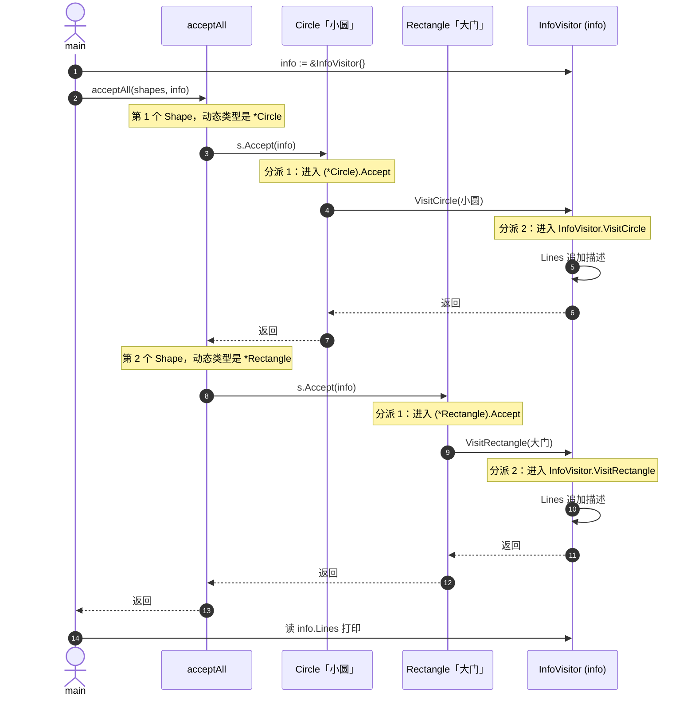

# 双重分派：分派 1 与分派 2

对照代码：`evolve/step3_访问者/main.go`。

主线调用：

```go
s.Accept(info)   // 或 s.Accept(area)
```

这里会发生两次「按运行时类型选方法」，所以叫双重分派（Double Dispatch）。

---

## 1. 什么叫分派

调用方法时，编译器 / 运行时要回答：

> 这么多同名或相关方法，到底进哪一个实现？

- 只根据**一个**东西的类型来选 → 单分派（Go 平时就是这样）。
- 连续根据**两个**东西的类型来选 → 双重分派（访问者要模拟的就是这个）。

这两个「东西」在访问者里是：

| | 是谁 | 例子 |
|---|---|---|
| 第一个 | 元素 `s` | `*Circle` / `*Rectangle` |
| 第二个 | 访问者 `v` | `*InfoVisitor` / `*AreaVisitor` |

目标组合其实是一张表：

| | `InfoVisitor` | `AreaVisitor` |
|---|---|---|
| `Circle` | 拼描述 | 算 πr² |
| `Rectangle` | 拼描述 | 算宽×高 |

单靠一次 `s.Xxx()` 选不出这张表的格子，所以要两次。

---

## 2. 分派 1：按元素类型选 Accept

调用：

```go
s.Accept(info)
```

此时：

- `s` 的静态类型是 `Shape`（接口）。
- `s` 的动态类型可能是 `*Circle` 或 `*Rectangle`。

Go 看 `s` 里面真正装着谁，决定进哪个 `Accept`：

```text
s 实际是 *Circle     → 进  (*Circle).Accept
s 实际是 *Rectangle  → 进  (*Rectangle).Accept
```

这就是分派 1。只解决一个问题：**当前元素是圆还是矩形？**

对应代码：

```go
func (c *Circle) Accept(v Visitor) {
    v.VisitCircle(c)      // 圆只调 VisitCircle
}

func (r *Rectangle) Accept(v Visitor) {
    v.VisitRectangle(r)   // 矩形只调 VisitRectangle
}
```

注意：分派 1 还没决定算面积还是收集信息。`Accept` 里只是说：「我是圆，请按圆的方式访问我。」

---

## 3. 分派 2：按访问者类型选 VisitXxx

还在圆的 `Accept` 里，继续执行：

```go
v.VisitCircle(c)
```

此时：

- 方法名已经由分派 1 定为 `VisitCircle`（不是 `VisitRectangle`）。
- `v` 的静态类型是 `Visitor`。
- `v` 的动态类型是 `*InfoVisitor` 或 `*AreaVisitor`。

Go 再按 `v` 的真实类型，选 `VisitCircle` 的哪个实现：

```text
v 是 *InfoVisitor  → 进 InfoVisitor.VisitCircle   （写 Lines）
v 是 *AreaVisitor  → 进 AreaVisitor.VisitCircle   （加 Total）
```

这就是分派 2。解决第二个问题：**请来的是信息访问者还是面积访问者？**

---

## 4. 两次合在一起

以「小圆 + info」为例：

```text
acceptAll → s.Accept(info)
              │
              │  分派 1：s 是 *Circle
              ▼
         (*Circle).Accept(info)
              │
              │  调用 v.VisitCircle(c)
              │  分派 2：v 是 *InfoVisitor
              ▼
         InfoVisitor.VisitCircle(小圆)   ← 落到表格「圆 × 信息」那一格
```

换成「小圆 + area」：

```text
分派 1：同样进 (*Circle).Accept       （元素没变，Accept 路径一样）
分派 2：进 AreaVisitor.VisitCircle    （访问者变了，Visit 实现变了）
```

所以：

- 分派 1 回答：元素是谁 → 选 `VisitCircle` 还是 `VisitRectangle`。
- 分派 2 回答：访问者是谁 → 选 Info 版还是 Area 版的 `VisitCircle`。

---

## 5. 时序图（acceptAll + info）



`info` 在这里的作用：不是 select，而是**这一趟的访问者（算法 + 状态）**。`shapes` 不变，换 `info` / `area` 就是换工人。

| 调用 | 第二个参数 | 这一趟干的事 | 结果存在哪 |
|------|------------|--------------|------------|
| `acceptAll(shapes, area)` | `*AreaVisitor` | 算面积 | `area.Total` |
| `acceptAll(shapes, info)` | `*InfoVisitor` | 收集描述 | `info.Lines` |

---

## 6. 为什么 Go 要拆成 VisitCircle / VisitRectangle

理想情况是一次写成：

```go
v.Visit(c)  // 希望同时按 v 的类型和 c 的类型选实现
```

很多支持方法重载的语言可以靠「参数类型不同」做第二次分派。Go 没有方法重载，不能写两个都叫 `Visit`、参数分别是 `*Circle` / `*Rectangle` 的方法。

所以访问者用「笨但清楚」的办法：

1. 分派 1 进到具体元素的 `Accept`。
2. 元素亲手点名该调 `VisitCircle` 还是 `VisitRectangle`。
3. 再对 `v` 做一次接口方法分派（分派 2）。

`Accept` 里那一行 `v.VisitCircle(c)`，本质就是人工完成第二次分派的前半段（选定方法名）。

---

## 7. 和 step2 的 type switch 对比

step2：

```go
switch x := s.(type) {
case *Circle:
    // 直接在这里写「信息」或「面积」逻辑
}
```

一次 switch 里同时知道了元素类型，并立刻写死某一种操作。换操作就要再写一个带完整 switch 的函数。

step3：

- 分派 1 ≈ switch 里的 `case *Circle`（由 `Accept` 承担）。
- 分派 2 ≈ 再按操作种类分支（由不同 Visitor 的 `VisitCircle` 承担）。

把「元素分支」和「操作分支」拆开了，所以换 `info` / `area` 不用改圆和矩形。

---

## 8. 一句话记忆

> 分派 1：`s.Accept(v)` —— 先按**图**是谁，走进圆或矩形的 `Accept`。  
> 分派 2：`v.VisitXxx(...)` —— 再按**访客**是谁，走进 Info 或 Area 的具体逻辑。  
> 两次类型都对上了，才落到「正确元素 × 正确操作」那一格。
