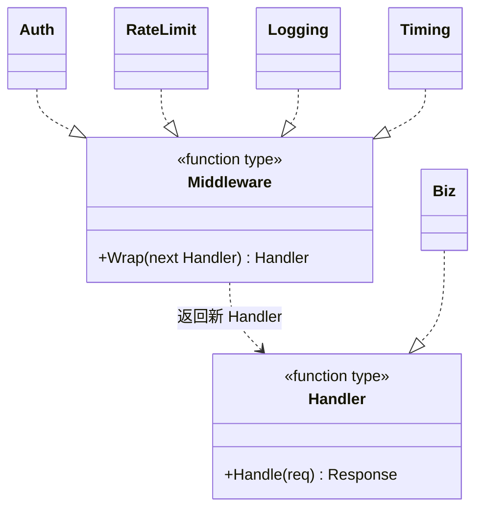

# 责任链模式（Chain of Responsibility）— Go 语言

用 **HTTP 中间件管道** 来理解：

> **请求沿中间件链往下走：鉴权 → 限流 → 日志 → 业务。**  
> 每一层决定：调用 `next` 继续，还是直接返回（短路）。  
> 发送方只认链头，不点名具体中间件。

---

## 1. 用一张表想清楚

| | Auth | RateLimit | Logging | Biz |
|---|---|---|---|---|
| **每个请求都可能经过** | 要 | 要 | 要 | 要（前面都放行时） |
| **可以单独拦下请求** | 401 | 429 | 一般不拦 | — |

### 1.1 不会责任链时（step1）

`Server.Serve` 里写死：

```go
if req.Token == "" { return 401 }
if remain <= 0 { return 429 }
// 打日志
return handleBiz(req)
```

横切逻辑和业务粘在一个方法里；加计时、换顺序都要改 `Serve`。

### 1.2 会责任链时（step2 / step3）

- `Middleware = func(next Handler) Handler`
- `Chain(Auth, RateLimit, Logging).Then(Biz)` 只在组装处表达顺序
- 加 `Timing` = 新函数 + `Chain` 多一个参数，**旧中间件与 Biz 不动**

```text
Chain(Timing, Auth, RateLimit, Logging).Then(Biz)
  → Timing → Auth → RateLimit → Logging → Biz
```

### 1.3 演变目录（建议先跑）

| 步骤 | 目录 | 要体会的点 |
|------|------|------------|
| 1 | `evolve/step1_写死管道` | `Serve` 里顺序写死；加一层就改核心 |
| 2 | `evolve/step2_中间件链` | `Middleware` + `Chain`；不调 `next` 即短路 |
| 3 | `evolve/step3_只加新中间件` | 只加 `Timing`，旧代码不动 |

```bash
cd evolve/step1_写死管道 && go run .
cd ../step2_中间件链 && go run .
cd ../step3_只加新中间件 && go run .
```

最终形态见同级 `main.go`（≈ step3，并多演示一次限流）。

---

## 2. 定义

### 2.1 官方味道的定义

责任链模式是一种**行为型**设计模式：让多个对象都有机会处理请求，从而避免请求发送者与接收者耦合。将这些对象连成一条链，并沿着链传递请求，直到有对象处理它（或按约定全部过一遍）。

落到本例（中间件变体）：

| 模式角色 | 本例 | Web 对应 |
|----------|------|----------|
| Handler | `Handler` | `http.Handler` / 业务函数 |
| ConcreteHandler | `Auth` / `RateLimit` / `Logging` / `Timing` | 中间件 |
| Client | `main` 里 `Chain(...).Then(Biz)` | 路由注册 / 引擎组装 |

本笔记是 **「能处理的都过一遍，某层可短路」**——和 Gin / Echo / net/http middleware 同一族。  
审批流那种「找到一人就停」也是责任链，只是终止条件不同。

### 2.2 UML（只看「一层包一层 next」）



结构速览（洋葱从外到内）：

```text
Client
  │ handler(req)
  ▼
Timing
  └─ Auth
       └─ RateLimit
            └─ Logging
                 └─ Biz
```

要点：

- 每个中间件只依赖 `next Handler`，不依赖下一个具体名字。
- 不调用 `next` = 链在此处断开（责任链的「处理并终止」）。
- Go 里常用函数类型表达，不必先上 `interface` + `SetNext`；语义相同。

### 2.3 和「装饰器」差在哪（一句话）

装饰器强调**叠加能力、层层增强同一对象**；中间件责任链强调**处理权与是否继续传递**。结构都像套娃，意图不同：一个偏「包装增强」，一个偏「沿链决策」。

---

## 3. 常见场景

| 场景 | 为什么适合 |
|------|------------|
| HTTP / RPC 中间件 | 鉴权、限流、日志、追踪按序执行 |
| 过滤器管道 | 请求预处理、响应后处理 |
| 审批流 | 按金额 / 级别找第一个能批的人 |
| 异常处理链 | 从具体到通用逐级尝试处理 |
| IDE / 编辑器按键 | 快捷键、输入法、控件逐级消化事件 |

Go 里更接地气的说法：

- 横切逻辑不想写进每个业务函数。
- 顺序会变、节点会增减，希望只改组装处。

---

## 4. 示范代码

完整可运行见同级 `main.go`。

### 4.1 Handler / Middleware / Chain

```go
type Handler func(req *Request) *Response
type Middleware func(next Handler) Handler

type chain []Middleware

func Chain(ms ...Middleware) chain { return ms }

// Chain(A, B, C).Then(biz) 执行顺序：A → B → C → biz
func (ms chain) Then(final Handler) Handler {
	h := final
	for i := len(ms) - 1; i >= 0; i-- {
		h = ms[i](h)
	}
	return h
}
```

### 4.2 具体中间件（可短路）

```go
func Auth(next Handler) Handler {
	return func(req *Request) *Response {
		if req.Token == "" {
			return &Response{Status: 401, Message: "unauthorized"}
		}
		req.User = "user-" + req.Token
		return next(req) // 放行
	}
}
```

限流、日志、计时同理：前置逻辑 →（可选）`next(req)` → 后置逻辑。

### 4.3 使用

```go
func main() {
	remain := 2
	handler := Chain(Timing, Auth, RateLimit(&remain), Logging).Then(Biz)

	handler(&Request{Path: "/api/ping", Token: ""})
	handler(&Request{Path: "/api/ping", Token: "abc"})
}
```

```bash
cd 设计模式/责任链模式
go run .
```

---

## 5. 两种「传法」对照

| 策略 | 含义 | 本笔记 |
|------|------|--------|
| **找到一个就停** | 某节点处理后不再往下 | 审批流常见；本例 Auth/限流「拒绝」时也是停 |
| **能处理的都过一遍** | 放行则继续 `next` | 成功路径上的 Auth→限流→日志→业务 |

中间件日常是第二种；拒绝时用「不调 next」回到第一种。

---

## 6. 总结

### 6.1 只记三句

1. **沿链传递**：发送者不点名最终处理者。
2. **next 是开关**：调用则继续，不调用则短路。
3. **加中间件改组装**：step3 的体感。

### 6.2 优缺点速查

| | |
|--|--|
| 优点 | 解耦发送与处理；动态调序 / 插拔；消肿 `if-else` |
| 缺点 | 链太长难调试；请求可能「失踪」（忘记兜底）；多余节点有开销 |

### 6.3 选型一句话

> 当「同一请求可能被多个处理者按序处理或拦截」，且处理顺序 / 节点还会变时，用责任链（中间件）；永远只有固定一两步时，直接写函数调用就够。
