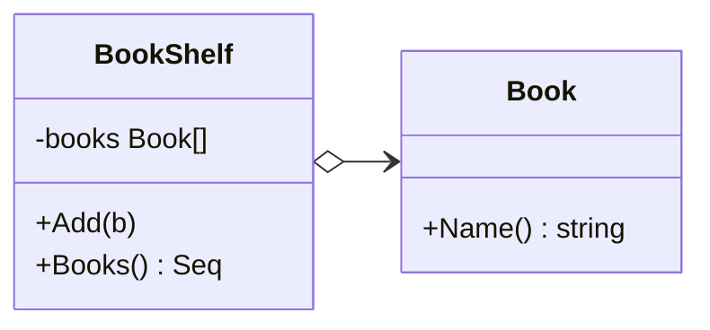

# 书架示例 — 迭代器模式（线性聚合）

> 父文档：[迭代器模式.md](../迭代器模式.md)

本例用「书架」说明：线性集合如何通过 `iter.Seq` 对外提供遍历，而不暴露内部切片。

---

## 1. 意图

客户端需要按顺序读每一本书，但不该依赖 `BookShelf` 到底用 `[]*Book`、链表还是别的结构。

对外只给：

```go
for b := range shelf.Books() {
    // ...
}
```

---

## 2. 角色对照

| GoF | 本例 |
|-----|------|
| Aggregate | `BookShelf` |
| Iterator | `Books() iter.Seq[*Book]` |
| Element | `Book` |
| Client | `main` |



---

## 3. 关键实现

```go
func (s *BookShelf) Books() iter.Seq[*Book] {
	return func(yield func(*Book) bool) {
		for _, b := range s.books {
			if !yield(b) {
				return // 调用方 break / return，停止推送
			}
		}
	}
}
```

要点：

- `books` 字段小写，包外不可见（本 demo 同包 `main`，刻意演示「不要直接下标扫」）。
- `yield` 返回 `false` 必须立刻停，否则 `break` 无效。
- 换存储时只改 `Books()` 循环体，`main` 的 `range` 不变。

---

## 4. 运行

```bash
cd 设计模式/迭代器模式/书架
go run .
```

示例输出：

```text
[Add] 设计模式
[Add] 重构
[Add] 代码整洁之道

========== 用迭代器遍历（不碰内部切片）==========
  1. 设计模式
  2. 重构
  3. 代码整洁之道

========== 提前 break（验证 yield 协议）==========
  读到: 设计模式（然后 break）

书架共 3 册
```

---

## 5. 和目录树的关系

书架是**一维**聚合；树形见 [`../目录树/`](../目录树/)——同一套 `iter.Seq` 思路，内部改成 DFS。
