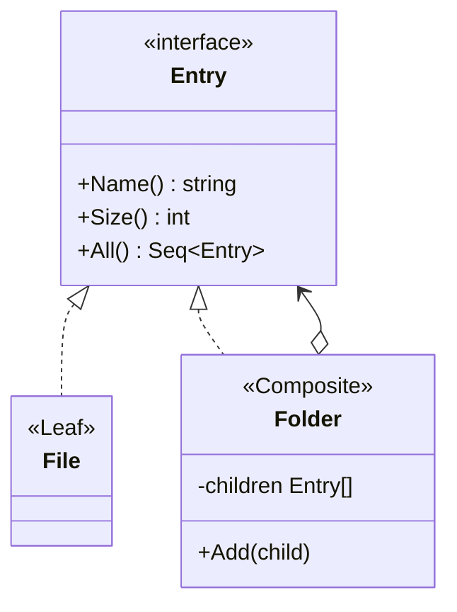

# 目录树示例 — 迭代器模式（组合 + DFS）

> 父文档：[迭代器模式.md](../迭代器模式.md)  
> 结构对照：[组合模式](../../组合模式/组合模式.md)（同题材文件系统）

本例在组合树之上增加 `All() iter.Seq[Entry]`：客户端用 `range` 做深度优先遍历，自己不写递归。

---

## 1. 意图

组合解决「文件 / 文件夹同一接口」；迭代器解决「按固定顺序走遍所有节点，且不把递归细节留给调用方」。

```go
for e := range root.All() {
    // 每个 Entry 都会走到：文件夹与文件
}
```

---

## 2. 角色对照

| GoF / 配合 | 本例 |
|------------|------|
| Component / Leaf / Composite | `Entry` / `File` / `Folder` |
| Aggregate + Iterator | `All() iter.Seq[Entry]` |
| Client | `main` |



---

## 3. 遍历顺序（DFS：先己后子）

对示例树：

```text
docs/
├── readme.txt
└── images/
    ├── logo.png
    └── banner.png
```

`root.All()` 交出顺序：

```text
docs → readme.txt → images → logo.png → banner.png
```

实现要点：

```go
func (d *Folder) All() iter.Seq[Entry] {
	return func(yield func(Entry) bool) {
		if !yield(d) {
			return
		}
		for _, c := range d.children {
			for e := range c.All() {
				if !yield(e) {
					return
				}
			}
		}
	}
}
```

- `File.All()`：只 `yield` 自己。
- `Folder.All()`：先自己，再嵌套 `range child.All()`。
- 内层 `yield` 为 `false` 时立刻 `return`，保证外层 `break` 能停整棵树。

---

## 4. 与组合模式 `Print` 的差别

| | 组合模式示范 | 本例 |
|--|--------------|------|
| 递归位置 | 在 `Print` / `Size` 方法内部 | 在 `All()` 的 Seq 内部 |
| 客户端 | 调一次 `Print`，输出格式写死在类型里 | `range All()`，打印 / 过滤 / 统计可自由组合 |
| 关系 | 不冲突 | 可并存：结构用组合，遍历用迭代器 |

---

## 5. 运行

```bash
cd 设计模式/迭代器模式/目录树
go run .
```

示例输出：

```text
[Add] docs ← readme.txt
[Add] images ← logo.png
[Add] images ← banner.png
[Add] docs ← images

========== DFS：for e := range root.All() ==========
  [dir ] docs  (130KB)
  [file] readme.txt  (10KB)
  [dir ] images  (120KB)
  [file] logo.png  (40KB)
  [file] banner.png  (80KB)

========== 提前 break（只看前两个节点）==========
  → docs
  → readme.txt
```

---

## 6. 刻意未做

- BFS（广度优先）第二套 Seq：需要时可再加 `AllBFS()`。
- 遍历中修改树：本示例假定 `range` 期间结构不变。
