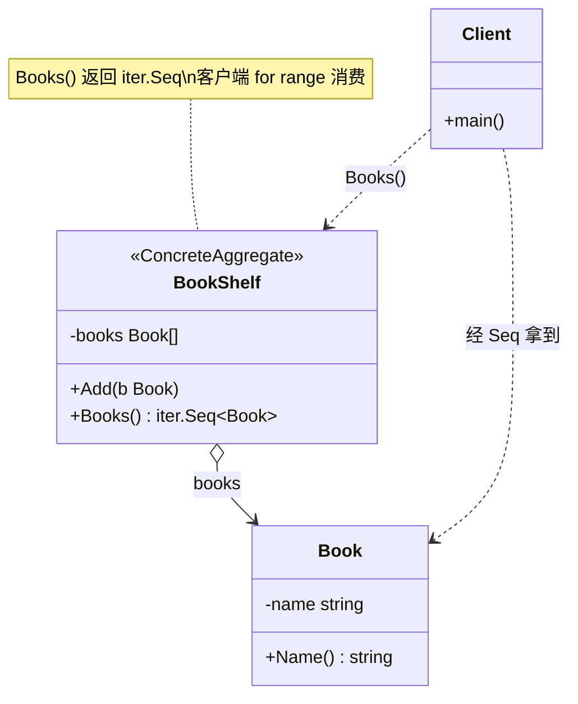

# 迭代器模式（Iterator Pattern）— Go 语言

迭代器模式的核心一句话：

> **把「怎么遍历」从集合内部拆出去**——客户端统一 `for x := range agg.Seq()`，不必知道里面是切片、树，还是别的结构。

本材料面向自学，主路径用 Go 1.23+ 的 `iter.Seq` / `range` over func（现代写法），不再以 `HasNext`/`Next` 为主。

---

## 1. 定义

### 1.1 官方味道的定义

迭代器模式是一种**行为型**设计模式：提供一种方法顺序访问聚合对象中的各个元素，而又不暴露该对象的内部表示。

做法是：

1. 集合（Aggregate）持有数据，并提供「创建遍历方式」的入口。
2. 迭代器封装游标与前进逻辑；客户端只依赖统一的遍历接口。
3. 换存储、换遍历顺序时，尽量只改集合侧，调用方仍是 `range`。

### 1.2 角色关系（UML 类图）

以「书架」为例（线性集合）：



图例：

| 线 | UML 含义 | 在本例里 |
|----|----------|----------|
| `o→` | 组合 / 持有 | `BookShelf` 持有 `[]*Book` |
| `‥>` | 依赖 | Client 调用 `Books()`，再消费元素 |

结构速览：

```text
Client
  │  for b := range shelf.Books()
  ▼
BookShelf（Aggregate）──内部──► []*Book
  │
  └── Books() → iter.Seq[*Book]（Iterator 的现代形态）
```

要点：

- Client **不**直接拿内部切片下标乱扫（封装边界由你决定；本例不导出 `books`）。
- 迭代器在 Go 里常常是一个 **返回 `iter.Seq[T]` 的方法**，而不是单独的 `XxxIterator` 类型。
- 树形结构同理：见 `目录树/`，`All()` 在内部做 DFS，对外仍是 `range`。

### 1.3 和「直接 for range 切片」差在哪（一句话）

切片本身就能 `range`；迭代器强调的是：**对外只给遍历入口，内部表示可换**（换树、换惰性生成、换过滤），调用方写法不变。

### 1.4 和「组合模式」怎么配合

| 模式 | 管什么 |
|------|--------|
| 组合 | 部分与整体同一接口（File / Folder 都是 Entry） |
| 迭代器 | 按某种顺序访问所有元素（或不暴露递归细节） |

树用组合搭好，再用迭代器把「深度优先走一遍」收成 `All()`——见 `目录树/`。

---

## 2. 常见场景

| 场景 | 为什么适合 |
|------|------------|
| 自定义集合 | 不想暴露底层 `map`/`slice`/链表细节 |
| 多种遍历顺序 | 正序 / 倒序 / 过滤后的视图，各自一个 Seq |
| 树 / 图 | 客户端不想手写递归或栈 |
| 惰性序列 | 边算边 yield，不必一次性装进切片 |
| 统一消费方 | 多个数据源都交付 `iter.Seq[T]`，下游只认 Seq |

Go 里更接地气的说法：

- 你已经在用 `range`；模式帮你把「可 range 的能力」做成集合的一等 API。
- Go 1.23+ 标准库用 `iter.Seq` 表达「推送式」迭代，和 GoF 的 Iterator 同意图、不同形态。

---

## 3. 本目录怎么读

| 子目录 | 学什么 | 运行 |
|--------|--------|------|
| [`书架/`](./书架/) | 线性聚合 + `Books() iter.Seq` | `cd 书架 && go run .` |
| [`目录树/`](./目录树/) | 组合结构 + DFS `All() iter.Seq` | `cd 目录树 && go run .` |

建议顺序：先书架把角色跑通，再目录树看「结构模式 + 行为模式」叠在一起。

### 3.1 与经典 `HasNext`/`Next` 的对照（一句）

教科书常见：

```text
for it := agg.CreateIterator(); it.HasNext(); {
    x := it.Next()
}
```

现代 Go 等价意图：

```go
for x := range agg.Items() { // Items() iter.Seq[T]
    // ...
}
```

游标与终止条件收进 `Seq` 的 `yield` 协议里；自学优先掌握后者即可。

---

## 4. 总结

### 4.1 记住三件事

1. **意图**：顺序访问元素，不暴露内部表示。
2. **机制（Go）**：集合提供 `iter.Seq[T]`；客户端 `range`；内部用 `yield` 推送。
3. **适用边界**：需要隐藏结构或统一多种遍历时香；公开切片且只扫一次时，直接 `range` 更诚实。

### 4.2 优缺点速查

| | 说明 |
|---|------|
| 优点 | 调用方与内部结构解耦；可换顺序 / 惰性 / 过滤而不改消费代码 |
| 优点 | 与组合等结构模式自然配合（树的 `All()`） |
| 缺点 | 简单切片再包一层 Seq，有时是过度设计 |
| 缺点 | 遍历中若修改集合，需自行约定是否安全（本示例假定遍历期间不改结构） |

### 4.3 选型一句话

> 你希望「怎么存」和「怎么走」分开，且对外统一成 `range` 时，用迭代器；只是扫自己的切片，就直接 `range`。
